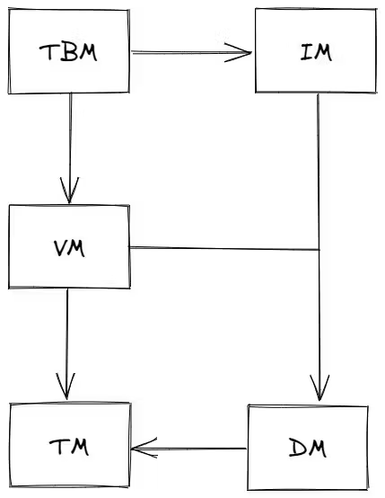
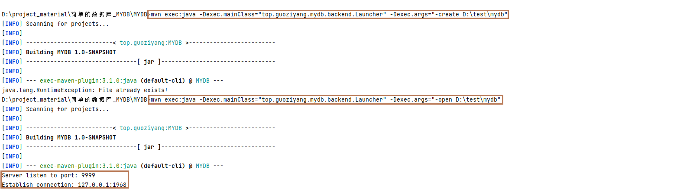
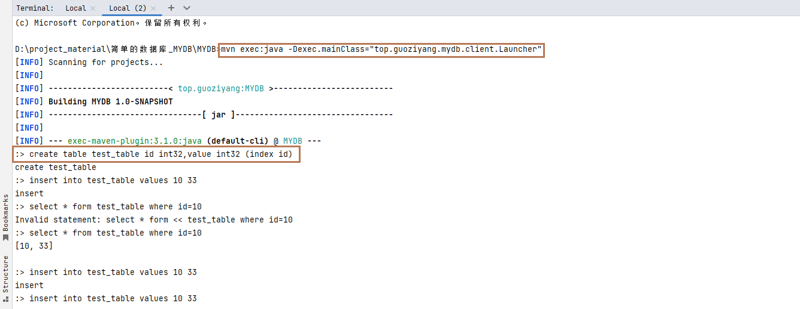

# MYDB

MYDB 是一个 Java 实现的简单的数据库，部分原理参照自 MySQL、PostgreSQL 和 SQLite。实现了以下功能：

- 数据的可靠性和数据恢复
- 两段锁协议（2PL）实现可串行化调度
- MVCC
- 两种事务隔离级别（读提交和可重复读）
- 死锁处理
- 简单的表和字段管理
- 简陋的 SQL 解析（因为懒得写词法分析和自动机，就弄得比较简陋）
- 基于 socket 的 server 和 client

## 1. 项目结构
五个模块如下：
1. Transaction Manager（TM）
2. Data Manager（DM）
3. Version Manager（VM）
4. Index Manager（IM）
5. Table Manager（TBM）
   
五个模块的依赖关系如下：



## 2. 运行方式
**分为两个方式，如下：**


### 2.1. WSL2 上运行
注意首先需要在 pom.xml 中调整编译版本，如果导入 IDE，请更改项目的编译版本以适应你的 JDK

首先执行以下命令编译源码：

```shell
mvn compile
```

接着执行以下命令以 /tmp/mydb 作为路径创建数据库：

```shell
mvn exec:java -Dexec.mainClass="top.guoziyang.mydb.backend.Launcher" -Dexec.args="-create /tmp/mydb"
```

随后通过以下命令以默认参数启动数据库服务：

```shell
mvn exec:java -Dexec.mainClass="top.guoziyang.mydb.backend.Launcher" -Dexec.args="-open /tmp/mydb"
```

这时数据库服务就已经启动在本机的 9999 端口。重新启动一个终端，执行以下命令启动客户端连接数据库：

```shell
mvn exec:java -Dexec.mainClass="top.guoziyang.mydb.client.Launcher"
```

会启动一个交互式命令行，就可以在这里输入类 SQL 语法，回车会发送语句到服务，并输出执行的结果。

一个执行示例：


### 2.2. Windows 上运行


首先执行以下命令编译源码：
```shell
mvn compile
```
接着执行以下命令以 /tmp/mydb 作为路径创建数据库：
```shell
mvn exec:java -Dexec.mainClass="top.guoziyang.mydb.backend.Launcher" -Dexec.args="-create D:\test\mydb"
```
**注意这个路径（D:\test\mydb）修改成自己的，例如（D:\test\mydb）**

随后通过以下命令以默认参数启动数据库服务：
```shell
mvn exec:java -Dexec.mainClass="top.guoziyang.mydb.backend.Launcher" -Dexec.args="-open D:\test\mydb"
```
运行上面成功出现下面


这时数据库服务就已经启动在本机的 9999 端口。重新启动一个终端，执行以下命令启动客户端连接数据库：
```shell
mvn exec:java -Dexec.mainClass="top.guoziyang.mydb.client.Launcher"
```

会启动一个交互式命令行，就可以在这里输入类 SQL 语法，回车会发送语句到服务，并输出执行的结果。


